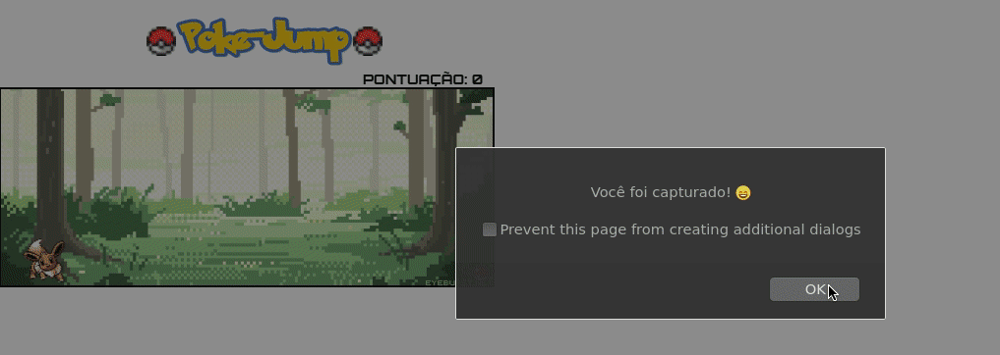

<h1 align="center">
  
</h1>

## 💬 Sobre o projeto

<h4>
  Utilização de uma versão simplificada jogo do dinossauro feito com a temática Pokémon para realizar o Desafio #1 do proposto no Workshop "propósito de ser mentor" do Space Squad.
</h4>

## 🆕 Features

<h4> 

 *  Score baseado a quantidade de obstáculos;<br />

 *  Evoluções de aparência da personagem de acordo com a pontuação atingida;<br />
 
 *  Backgrounds morning and night adicionados;<br />
</h4>
 
## ℹ Como jogar

<h4>
  1. Faça um git clone do repositório para sua máquina:<br /><br />

  https:
  ```bash
    git clone https://github.com/yants95/pokejump.git
  ```
  ssh:
  ```bash
    git clone git@github.com:yants95/pokejump.git
  ```

  2. Abra o arquivo index.html no navegador;<br />
  3. Recarregue a página para recomeçar;<br />
  4. Use o botão esquerdo do mouse para pular;<br />
</h4>
 
## 💜 Demo
 
<p align="center">
  
</p>
